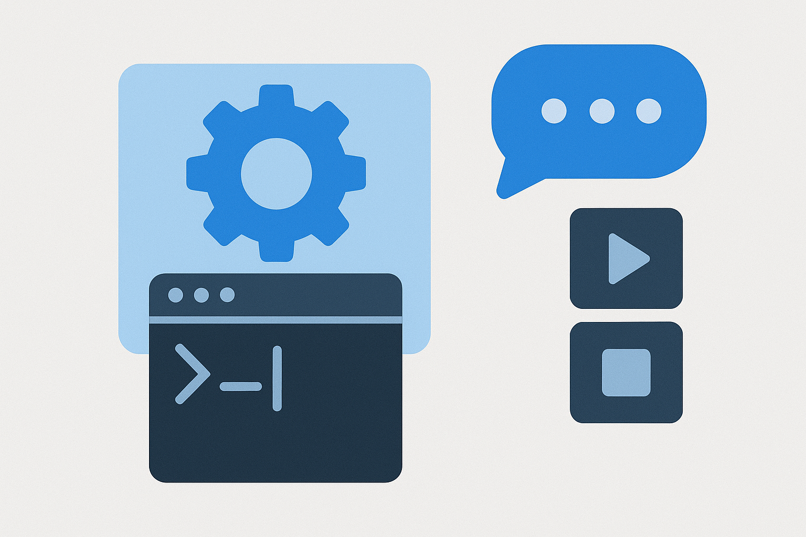

# Counter



### Описание

### Возможности

### Зависимости

- C++20

### Опции сборки

Проект предоставляет следующие опции сборки через CMake:

- **BUILD_SHARED_LIBS** - выбор типа библиотеки для сборки:
    - `ON` (по умолчанию) — сборка динамической библиотеки (`.so`)
    - `OFF` - сборка статической библиотеки (`.a`)

- **BUILD_EXAMPLE** - включение/отключение сборки примера:
    - `ON` - собирать пример использования библиотеки
    - `OFF` (по умолчанию) — не собирать пример

### Сборка

Проект использует CMake для сборки:

````bash
mkdir build
cd build
cmake ..
make
````

#### Сборка только статической библиотеки

````bash
mkdir build
cd build
cmake -DBUILD_SHARED_LIBS=OFF ..
make
````

#### Сборка только статической библиотеки без примера

``` bash
mkdir build
cd build
cmake -DBUILD_SHARED_LIBS=OFF -DBUILD_EXAMPLE=OFF ..
make
```

#### Для создания пакета DEB:

``` bash
cd build
make package
```

### Установка

После сборки можно установить библиотеку:

``` bash
sudo make install
```

Или установить созданный DEB-пакет:

``` bash
sudo dpkg -i libstarter0*.deb
```

При сборке динамической библиотеки создаются два пакета:

- `libstarter0` - содержит саму динамическую библиотеку
- `libstarter0-dev` - содержит заголовочные файлы и символьные ссылки для разработки

При сборке статической библиотеки создается только один пакет:

- `libstarter0-dev` - содержит статическую библиотеку и заголовочные файлы

### Пример вывода программы
